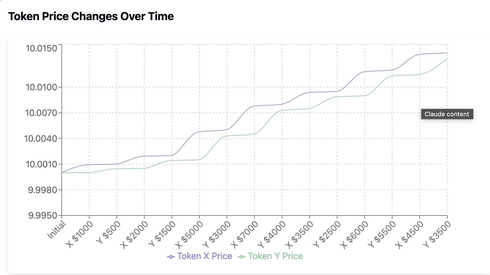

TugZone is a gamified token launchpad where two tokens battle for liquidity in time-based "Wars." Users pick a side, buy tokens, and the one with the highest sales wins. No selling during the war — only strategy, hype, and pure token warfare. After the war, the winning token hits the DEX.




Launch your token. Join the fight.
Two tokens. One winner. Welcome to TugZone.
# TugZone - Modern Web Application

TugZone is a full-stack web application built with Next.js, featuring a modern UI and robust backend integration.

## Tech Stack

- **Frontend**: Next.js 15.2, React 18, TypeScript
- **Styling**: Tailwind CSS, Radix UI Components
- **Backend**: Next.js API Routes
- **Database**: MongoDB with ORM
- **Authentication**: (To be implemented)

## Features

### Core Features
- 🎨 Modern and responsive UI using Radix UI components
- 🌓 Dark/Light mode support (in pipline)
- 🔄 Real-time data updates
- 📱 Mobile-first design
- 🔒 Type-safe development with TypeScript

### UI Components
- Customizable components using Radix UI
- Interactive forms with react-hook-form
- Toast notifications with sonner
- Custom animations with tailwindcss-animate
- Responsive layouts with react-resizable-panels
- Data visualization with recharts

### Backend Features
- RESTful API endpoints
- Database integration with Mongoose
- Secure data handling
- Type-safe database queries
- Efficient data caching

## Getting Started

1. **Clone the repository**
```bash
git clone <https://github.com/captr1g/TugZone.git>
cd tug-zone

for smart contracts
checkout the repository
git clone <sitory
git clone <https://github.com/captr1g/TugZone_SC.git>
cd tug-zone
read the README.md file for more information
contract adddress : "0xA541a5a652D7CA0bFD45Df5c1352c3983E3D7bF7"
[varified contract address link](https://sepolia.arbiscan.io/address/0xA541a5a652D7CA0bFD45Df5c1352c3983E3D7bF7#code)

```
workflow
econinomy model

tug-zone/
├── app/              # Next.js app directory
├── components/       # React components
├── lib/             # Utility functions 
├── prisma/          # Database schema 
├── public/          # Static assets
└── styles/          # Global styles